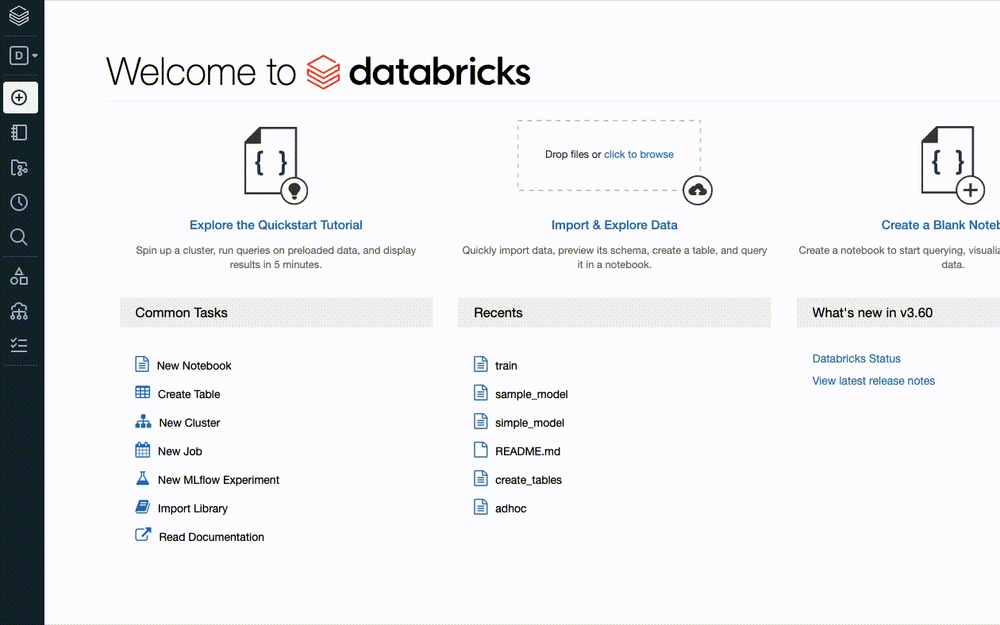
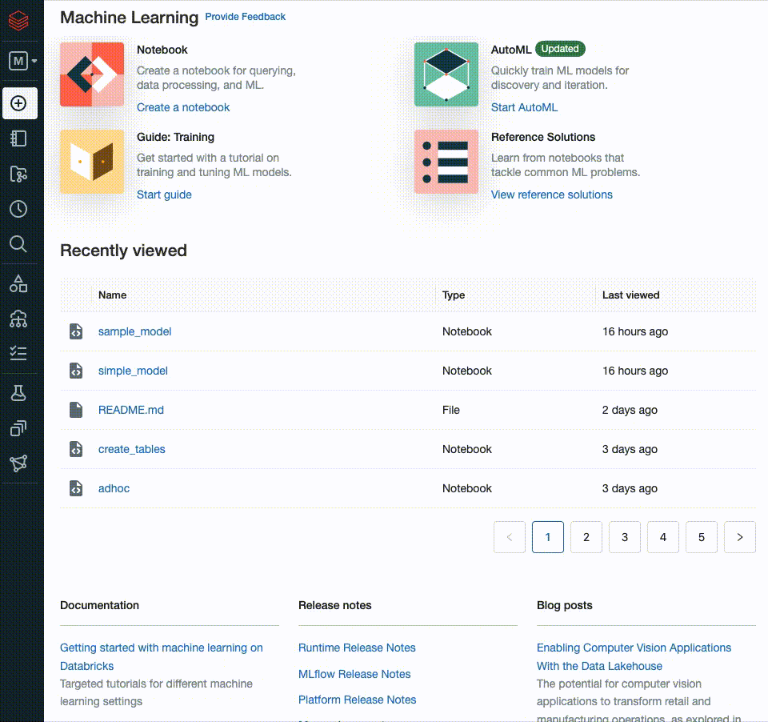

# Multimodal Transformer workflow with MLflow Projects
This project provides an example [MLflow Projects](https://www.mlflow.org/docs/latest/projects.html) workflow for modeling both free-formed text with categorical and numeric features using a huggingface transformer model. The typical classification head using by huggingface sequence for classification models is replaced with a head that accepts both word embeddings generated by a transformer model and categorical and numeric features. The example is based on [DistilBertForSequenceClassification](https://huggingface.co/docs/transformers/model_doc/distilbert#transformers.DistilBertForSequenceClassification) but can be extended to other architectures.

This project was inspired by the [Multimodal-Toolkit](https://github.com/georgian-io/Multimodal-Toolkit).  


## Training models remotely on Databricks and logging to Managed MLflow
Models can easily be trained on Databricks hosted GPU-backed VMs and logged to Managed MLflow by executing the following steps.  
1. Create an MLflow Tracking Server instance where all model training runs will be logged.

2. Copy the server's Experiment ID and store it in the runners/EXPERIMENT_ID file.
3. Configure the [Databricks CLI](https://docs.databricks.com/dev-tools/cli/index.html) on your local machine. This will allow your local machine to communicate with the Databricks Workspace.
    - Any easy way to test your connection is to list the Workspace directories from your terminal.  
        ```
        databricks fs ls --profile default
        ```
    - The first Workspace configured with the CLI will be tagged as the 'default' profile in the hidden .databrickscfg file that is created during CLI configuration. You can have multiple profiles corresponding to different Workspaces. 

    - MLflow Projects are directed to run remotely on a Databricks Workspace by setting an environement variable. The below example instructs MLflow to run the project on the default Workspace.
        ```
        export MLFLOW_TRACKING_URI=databricks
        ```
    
    - You can direct your MLflow Project to run in differnt Workspaces by configuring additional CLI profiles and specifying them in the environment variable.
        ```
        export MLFLOW_TRACKING_URI=databricks://e2-demo-east
        ```
 4. Validate the cluster.config.json file which specifies the compute that will be provisioned for training. Generating the JSON is easily done through the Databricks UI. In the Clusters section of the UI, choose the single node cluster type, a recent (or latest) ML runtime, and a GPU backed VM instance. To the right of the screen, choose JSON to view the JSON configuration of the cluster.
 

 5. After the above items are complete and your runners/db_runner.sh script is adjusted for your use, execute the script. Navigate to the MLflow Tracking Server to monitor training progress.
    ```
    bash /runners/db_runner.sh
    ```  


 ## Training a model locally and logging to local MLflow  
To run the project locally, simply execute the runners/local_runner.sh script, ensuring your working directory is the multimodal project directory.  

For local development and testing without a GPU, you can generate a small data sample by setting the training_sample_record_num parameters > 0. The parameter will sample the specified record number from the training dataset and also use this dataset for testing. This is to ensure there is no categorical variable value mismatched between the datasets that would through an error (a categorical value present in testing that is not present in training).

MLflow will create a directory, mlruns/, by default to store run information. To view runs via the [MLflow UI](https://www.mlflow.org/docs/latest/tracking.html#where-runs-are-recorded), navigate to the multimodal project directory in your terminal and start the UI.

```
mlflow ui
```


